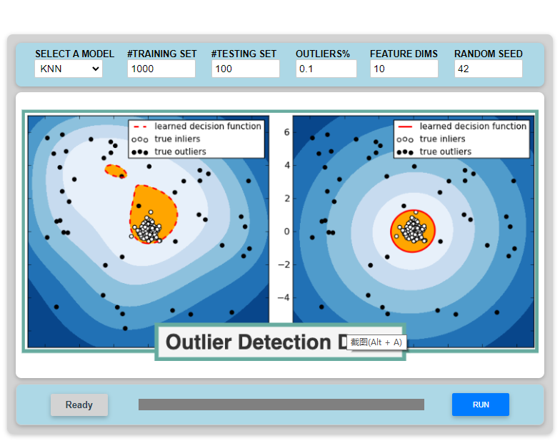
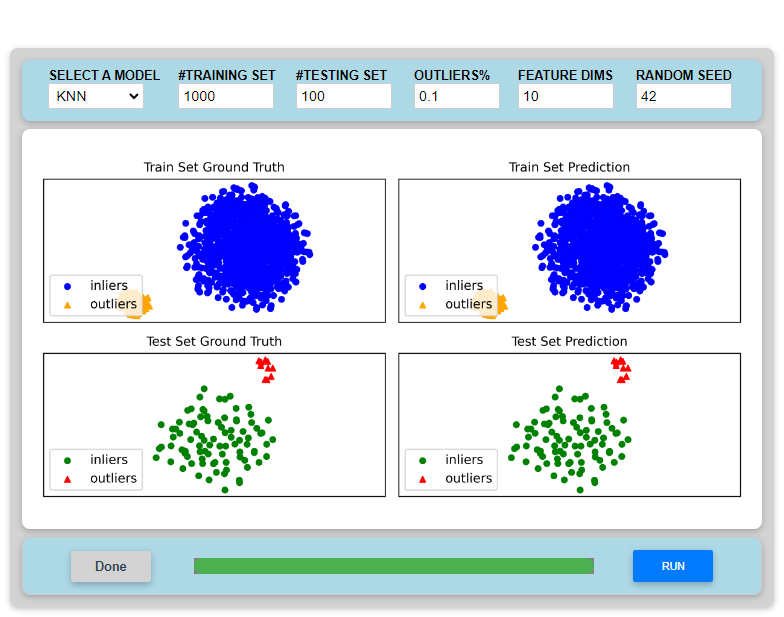

# Outlier Detection UI (Vue)

This is a simple UI for running different outlier detection algorithms on synthesized datasets. The backend of this UI is based on the `pyod` library and thus this UI can also be viewed as a simple demonstration interface of `pyod` (although unofficially developed).

## Screenshots

Just opened with a splash,

Detection results displayed,

## Usage

1. Install dependencies in `requirements.txt`.
2. run `app.py`.
3. In the `PARAMETERS` panel, set the parameters.
4. Press `RUN` to see the results.

Fixing the `Random Seed` and switching the models allow you to compare the performances of different models on the same dataset. Changing the seed or the parameters of the dataset (e.g., `Ratio of Outliers`, `Feature Dims`) will cause a different dataset to be loaded.

## TODO

1. Add the `EXPORT` button to allow dataset & detection results & model export.
2. ...

